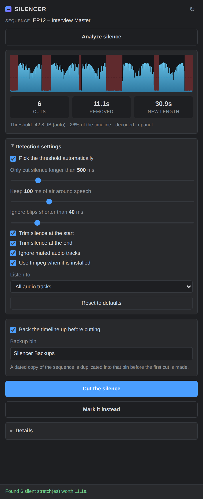
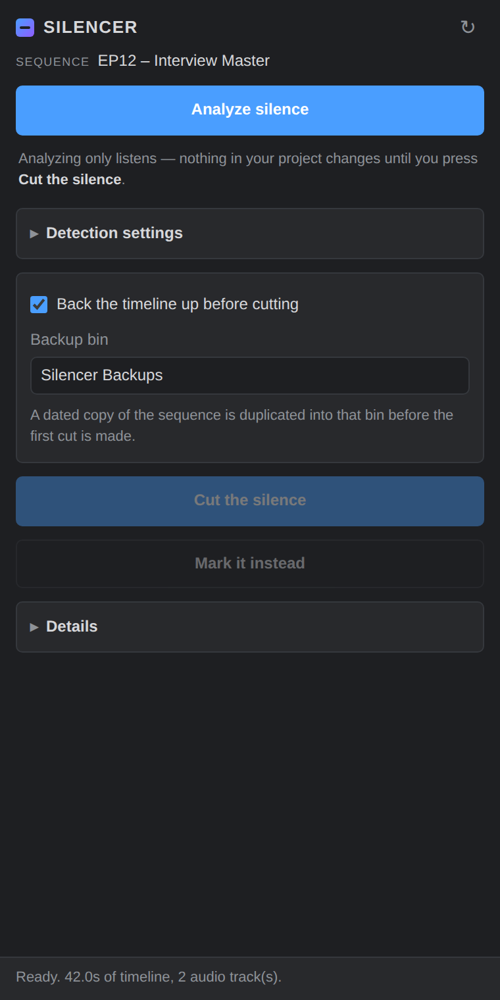
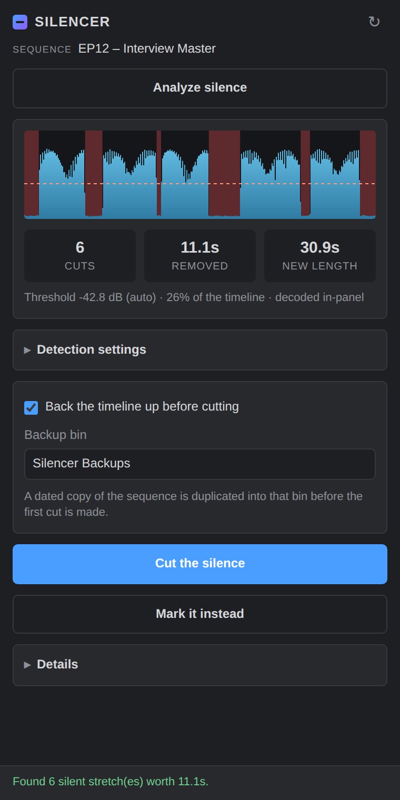
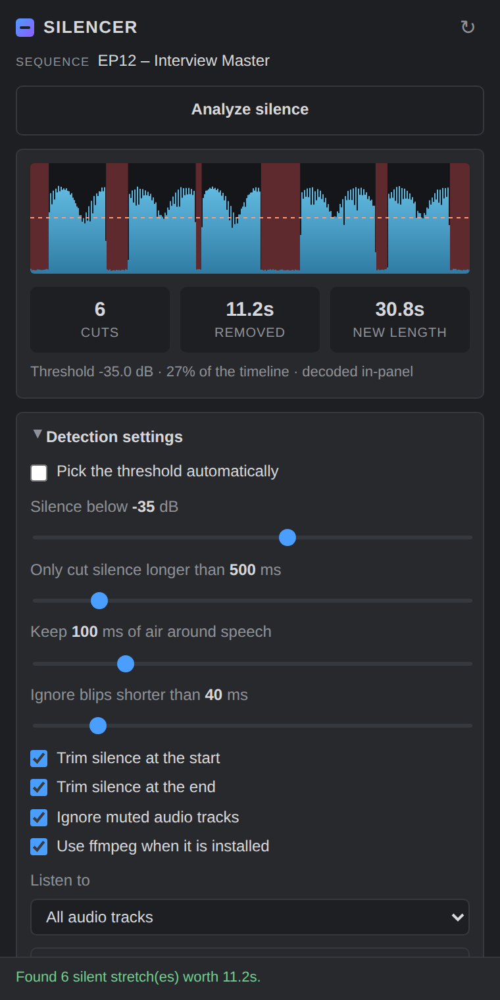

# Silencer

A Premiere Pro panel that finds the silence in your timeline and cuts it out.

<p align="center">
  
</p>

No account. No sign-in. No upload. No watermark. No "free trial". It runs
entirely on your machine, it never touches the network except for the one
optional ffmpeg download during install, and it is MIT licensed.

Before it removes anything it duplicates your sequence into a backup bin, so
the version you started with is always one double-click away.

---

## Install

### Windows

1. Download `Silencer-x.y.z-Setup.exe` from the
   [Releases page](https://github.com/NiteRix/Silencer/releases) and run it.
2. Restart Premiere Pro.
3. `Window > Extensions > Silencer`.

No admin rights, no UAC prompt — it installs into your own user folder.

Prefer not to run an installer? Download the portable zip, unpack it, and
double-click **`Install-Windows.bat`**. It does exactly the same thing.

### macOS

1. Download the portable zip from the
   [Releases page](https://github.com/NiteRix/Silencer/releases) and unpack it.
2. Double-click **`Install-Mac.command`**.
   If macOS blocks it, right-click the file and choose **Open** instead.
3. Restart Premiere Pro.
4. `Window > Extensions > Silencer`.

### From a clone

```bash
git clone https://github.com/NiteRix/Silencer.git
cd Silencer
./Install-Mac.command        # macOS
Install-Windows.bat          # Windows
```

### Uninstall

Run `Uninstall-Windows.bat` / `Uninstall-Mac.command`, or on Windows use
*Add or remove programs* if you used the `.exe`.

---

## Use

| Before analysing | After analysing | Settings |
|---|---|---|
|  |  |  |

1. Open the sequence you want to trim.
2. Open the panel and press **Analyze silence**.
3. The waveform shows what it heard; the red bands are what it plans to remove.
   Drag the sliders and the preview updates immediately — re-analysis after the
   first pass is instant, because the decoded audio is cached.
4. Press **Cut the silence**.

**Mark it instead** puts a marker over every silent stretch and changes
nothing else, which is a good way to sanity-check the settings on a timeline
you care about.

### Settings

| Setting | What it does |
|---|---|
| **Pick the threshold automatically** | Reads the loudness distribution of your timeline and sets the cutoff 26 dB below the speech level. Works well on almost everything. Turn it off if you want to dial it in by hand. |
| **Only cut silence longer than** | Gaps shorter than this are left alone. Raise it for a calmer edit, lower it for a tighter one. |
| **Keep N ms of air around speech** | Padding either side of every kept segment, so words don't lose their attack or tail. |
| **Ignore blips shorter than** | Stops a single mouse click or lip smack from counting as speech. |
| **Trim silence at the start / end** | Whether the head and tail of the timeline get trimmed too. |
| **Ignore muted audio tracks** | Muted tracks don't count towards "is this moment silent". |
| **Listen to** | Analyse every audio track, or just one — handy when your voice is on A1 and music is on A2. |

### The backup

Every cut run first duplicates the active sequence, renames it
`<name> [BACKUP 2026-09-19 143022]`, and drops it in a bin called
**Silencer Backups**. The original is left active, so you carry on editing
where you were. If a run goes wrong, open the backup and carry on from there.

You can switch this off. Don't.

---

## How it works

**Detection** happens in the panel. Every source file on the analysed audio
tracks is decoded to mono at 8 kHz and reduced to a loudness envelope — one
RMS reading in dBFS every 10 ms. Each timeline clip then paints its slice of
that envelope into sequence time, respecting its in-point and playback speed,
and overlapping clips resolve to whichever is louder. That gives a single
"how loud is the timeline right now" curve, which is what the threshold and
duration rules run against. Region edges are snapped inward to whole frames,
so Premiere never sees a sub-frame cut.

**Cutting** happens in ExtendScript, in three passes:

1. Split every video and audio track at both edges of every silent region.
2. Lift the silent segments out, leaving gaps.
3. Slide everything that remains to the left by the exact amount of silence
   that used to precede it.

That third step is why sync survives. The shift for each clip is computed from
the global silence map rather than from a chain of ripple deletes, so every
track moves by the same amount whether or not it had anything in the gap.

If Premiere refuses to split a clip at some point — a transition sitting on the
cut point is the usual reason — that *whole region* is dropped rather than
half-applied, and the panel tells you how many were skipped.

### ffmpeg

Silencer decodes audio using Chromium, which is built into the panel and covers
the common cases: MP4/H.264 with AAC, M4A, MP3, WAV, FLAC, OGG.

It does not cover ProRes, DNxHD, most `.mov` variants, or anything else
Chromium never learned. If ffmpeg is available Silencer uses it instead, which
handles everything Premiere can open and streams long files without loading
them into memory.

The installer offers to fetch ffmpeg for you. Otherwise, Silencer looks for it
in this order:

1. `<extension folder>/bin/ffmpeg` (where the installer puts it)
2. a path you set yourself: `localStorage.setItem('silencer.ffmpegPath', '/path/to/ffmpeg')`
3. your `PATH`
4. the usual suspects — `/opt/homebrew/bin`, `/usr/local/bin`, `C:\ffmpeg\bin`

The panel's **Details** section tells you which decoder it ended up using.

---

## Requirements

- Premiere Pro **14.0 (2020)** or newer for cutting.
  13.x (2019) can analyse and place markers, but it lacks the scripting call
  that moves clips.
- Windows 10+ or macOS 10.14+.
- ffmpeg is optional.

## Limitations

- **Transitions on a cut point** block that cut. Silencer skips the region
  rather than desyncing your timeline, and says so.
- **Locked tracks** stop the run before anything happens — unlock them first,
  otherwise they'd be left behind while everything else moved.
- **Merged clips, multicam sequences and nested sequences** have no single
  file on disk to analyse, so their audio is skipped. The panel counts them
  for you.
- It analyses the audio *files*, not Premiere's mixer, so clip gain, track
  volume automation and effects are not reflected in the loudness readings.

## Repository layout

```
extension/            the CEP panel, exactly as it gets installed
  CSXS/manifest.xml   what Premiere reads to find the panel
  index.html          panel UI
  js/                 detection, ffmpeg plumbing, waveform, controller
  jsx/Silencer.jsx    everything that touches the timeline
installer/windows/    Inno Setup script for the .exe
scripts/              syntax checks, tests, and the screenshot harness
Install-*.{bat,command}   the no-hassle installers
```

## Building the installers yourself

CI does this on every push, but locally:

```bash
node scripts/check-syntax.mjs    # parse every shipped script, check the manifest
node scripts/test.mjs            # detector and timeline-maths tests
iscc /DSourceRoot=. installer/windows/silencer-setup.iss   # Windows .exe
```

The tests run the real detector against synthetic audio and the real host-side
arithmetic in a sandbox, so most of Silencer can be verified without opening
Premiere. See [docs/screenshots](docs/screenshots) for regenerating the images.

## License

MIT — see [LICENSE](LICENSE).
